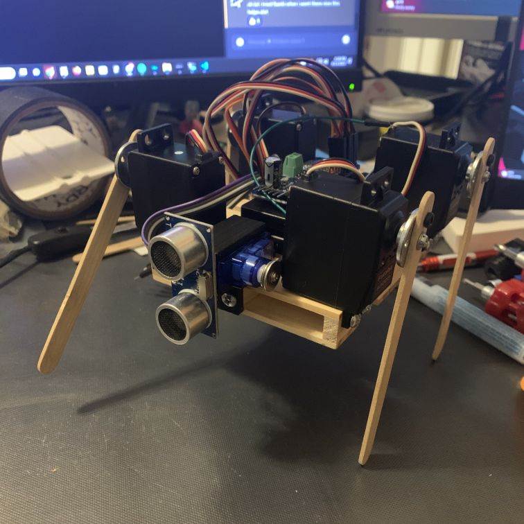

# Wobble

]

Phase 1 of the robotics project, home to the first working prototype of the Miniature Digging Robot. This repository showcases the initial creation, which features four walking legs and a distinctive digging tooth.

## How It's Made:

**Tech used:** Arduino C

Currently using Arduino C to directly control servos and read sensor data. 
